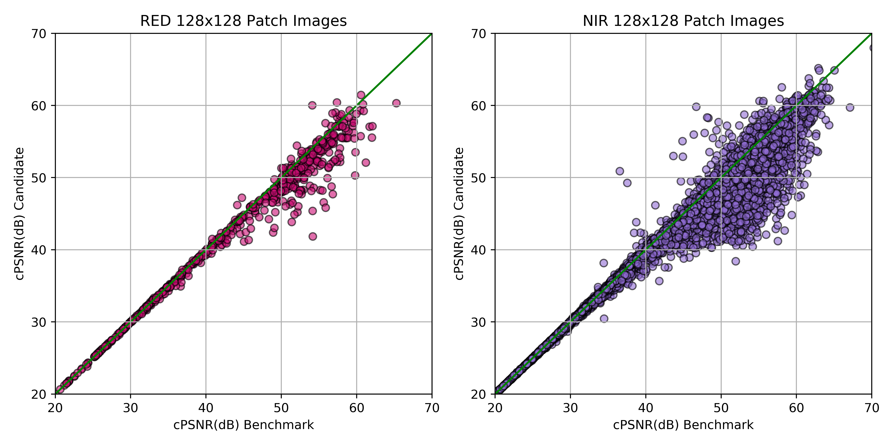
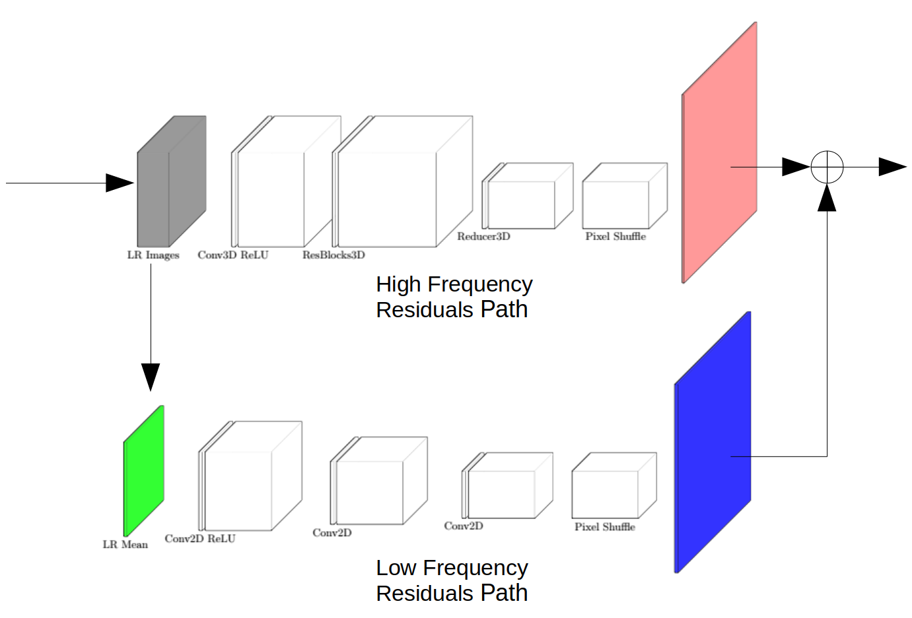
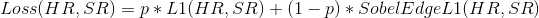
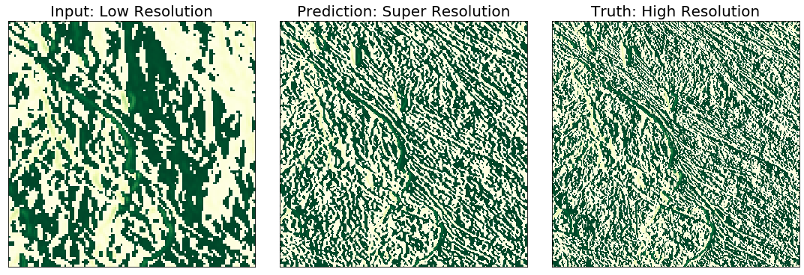

# EnhanceMe! : PROBA-V Super Resolution Challenge
[](https://paperswithcode.com/sota/multi-frame-super-resolution-on-proba-v?p=wide-activation-for-efficient-and-accurate) [](https://opensource.org/licenses/Apache-2.0) [](https://doi.org/10.5281/zenodo.3733116)

<p align="center">  </p>

A solution to the [PROBA-V Super Resolution Competition](https://kelvins.esa.int/proba-v-super-resolution/home/) that got **top 2** with a score of **0.9411** in this [leaderboard](https://kelvins.esa.int/proba-v-super-resolution-post-mortem/leaderboard/) as of March 30, 2020. This solution is inspired from [Francisco Dorr's repository](https://github.com/frandorr/PROBA-V-3DWDSR) which got the top 1 result last 2020/02/02. Please also note that I would have not formulated this solution without the current [breakthroughs](#references) in super resolution. All credit goes to them!

## Citation
If you find this repository useful in your research, please cite this repository. This will help me in case I pursue a PhD programme. So please... :joy:
```bibtext
@misc{mark_bajo_2020_3733116,
    author       = {Mark Bajo},
    title        = {{Multi-Frame Super Resolution of unregistered temporal images using WDSR nets}},
    month        = mar,
    year         = 2020,
    doi          = {10.5281/zenodo.3733116},
    version      = {1.0},
    publisher    = {Zenodo},
    url          = {https://doi.org/10.5281/zenodo.3733116}
    }
```
[](https://doi.org/10.5281/zenodo.3733116)


## TODO List
- [x] Preprocessing Pipeline
- [x] Training Framework
- [x] Prediction Framework (for competition submission)
- [x] Parse Config Framework
- [x] Preliminary Report
- [ ] Explore other model architectures such as GANS, [SAN](http://openaccess.thecvf.com/content_CVPR_2019/papers/Dai_Second-Order_Attention_Network_for_Single_Image_Super-Resolution_CVPR_2019_paper.pdf), etc.
- [ ] Bicubic Mean Technique comparison graph
- [ ] Code cleanup
- [ ] Low resource training backend
- [ ] Multi-GPU support
- [ ] Colored Images support
- [ ] BE TOP 1 AT LEAST ONCE!!!!!!! :confounded::confounded::confounded:

## Setup to get started
```python
pip3 install -r requirements.txt
```

My python version is 3.6.9. I used Ubuntu 18.04 OS for this project.

## Version that attained top 2 in the leaderboard
In case you would like to start with the version that attained top 2 in the PROBA-V leaderboard, please clone this repository and enter the following command.

```sh
git checkout 4af4959
```

## Usage
You should create a new cfg file with the format below. The current repository has a model in it. Should you wish to see the super resolution version of the dataset using my pretrained model, just run the preprocessing script and after that the test.py script and you are good to go. You must first download the data [here](https://kelvins.esa.int/proba-v-super-resolution/data/) and specify the directory of the raw data in the cfg file.
### Configuration (cfg) file
```sh
[Directories]
raw_data=probav_data            <Directory of the raw data.>
preprocessing_out=output        <Directory of where you want to put the output.>
model_out=modelInfo             <Directory of where you want to put the model checkpoints.>
train_out=trainout              <Directory of where you want to put predictions for the train data.>
test_out=testout                <Directory of where you want to put predictions for the test data.>

[Train]
batch_size=128                  <Batch size for training.>
epochs=100                      <Number of epochs for training.>
learning_rate=0.0005            <Number of epochs for training.>
optimizer=nadam                 <Optimizer to use for training.>
loss=l1                         <Loss to use for training.>
split=0.2                       <Validation split.>

[Net]
num_res_blocks=12               <Number of residual blocks for the model graph.>
num_low_res_imgs=9              <Number of low resolution images to pick for the model.>
scale=3                         <Upscale factor of the low resolution image to high resolution image.>
num_filters=32                  <Number of filters to use for each residual block.>
kernel_size=3                   <Kernel size of the convolution filter.>
exp_rate=8                      <Channel Expansion Multiple of the expansion block inside the residual block.>
decay_rate=0.8                  <Channel Decay Multiple of the decay block inside the residual block.>
is_grayscale=1                  <Is the input image grayscale? 1. If not, 0.>

[Preprocessing]
max_shift=6                     <Maximum possible shift to account in loss computation and model building.>
patch_size=16                   <Base patch size for each low resolution image.>
patch_stride=16                 <Base patch size for each low resolution image.>
num_low_res_imgs_pre=9          <Initial pool of low res images prior to clarity filters.>
low_res_patch_thresholds=0.85   <Clarity Threshold for the low resolution patches.>
low_res_threshold=0.85          <Clarity Threshold for the low resolution images.>
high_res_threshold=0.85         <Clarity Threshold for the high resolution images.>
num_low_res_permute=19          <Augment data by permuting the order of the low resolution images.>
to_flip=0                       <Augment data by flipping the images.>
to_rotate=0                     <Augment data by rotating the images.>
ckpt=1,2,3,4,5                  <Preprocessing checkpoints for debugging.>

```
### Preprocessing
```sh
python3 utils/dataGenerator.py --cfg cfg/p16t9c85r12.cfg \
                               --band NIR

```
### Train

The training was done in a computer with the following specifications:
* RAM: **64GB**
* Swap Space: **72GB**
* GPU: **GTX1080ti**

If you don't have a computer with high RAM, consider lowering the batch size or lowering the number of residual blocks of the network. If you have better specs, try raising the number of low resolution images and increasing the residual blocks for better performance.

```sh
python3 train.py --cfg cfg/p16t9c85r12.cfg \
                 --band NIR

```

I trained different set of weights for the NIR and RED band. If you have more than one GPU, it might be wise to train them simultaneously using the following code. I will implement multi-GPU support in the future.

```sh
CUDA_VISIBLE_DEVICES=0 python3 train.py --cfg cfg/p16t9c85r12.cfg \
                                        --band NIR

```

```sh
CUDA_VISIBLE_DEVICES=1 python3 train.py --cfg cfg/p16t9c85r12.cfg \
                                        --band RED

```

### Test
```sh
python3 test.py --cfg cfg/p16t9c85r12.cfg \
                --band NIR
```

### About evaluate.py
This script is for comparing two model results. It computes patches cPSNR and plots them in a, well, scatter plot.
The x-axis is the cPSNR of the benchmark model train/validation results (in my case the train/validation dataset that got me the top 2 spot). The y-axis is for the candidate model train/validation results. The result of the script should look something like this.

<p align="center">  </p>

As you can see, the dots are in "favor" of the benchmark model. You can conclude that the model you compared does not produce better SR images than your current top model. (Does that make sense? I know I am bad so let me add more pics to explain this better.)

To use the script type the following command at the shell. Please use at your own risk. This script is not yet complete. (I'm sorry!)

```sh
python3 evaluate.py --cfg cfg/p16t9c85r12.cfg \
                    --toCompare <folder of SR images produced by your "to compare" model.>
                    --benchmark <folder of SR images produced by your "benchmark" model.>
```


### Running TensorBoard
In case you don't know how to run tensorboard, please use the following command.
```sh
tensorboard --logdir <put here the dir you wrote in cfg file model_out section.>
```

## The Results
Here are what I tried. Most of them did not end well. **Posted below is the official score I got from the website.**

| Net           | Data          | ResBlocks | Filters  | Loss | Score |
| ------------- |:-------------:| -----:| -----:|-----:|-----:|
| Conv3D + WDSR    | Patches 32x32 70% Clarity 7 LR Images | 8 |32  |L1  |1.130 |
| Conv3D + WDSR      | Patches 38x38  90% Clarity 7 LR Images |   8 | 32    |L1    |0.9653  |
| Conv3D + WDSR      | Augmented Patches 38x38 85% Clarity 9 LR Images |   10 | 32    |L1    |0.9697	 |
| Conv3D + WDSR  | Augmented Patches 38x38 85% Clarity 9 LR Images |   10 | 32    |SobelL1Mix   |0.9728   |
| Conv3D + WDSR  | Augmented Patches 38x38 85% Clarity 9 LR Images |   12 | 32    |L1  |0.9591   |
| Conv3D + WDSR  | Augmented Patches 22x22 85% Clarity 9 LR Images |   8 | 32    |L1  |0.9550   |
| Conv3D + WDSR  | Augmented Patches 22x22 85% Clarity 9 LR Images |   12 | 32    |L1  |0.9536   |
| Conv3D + WDSR  | Augmented Patches 22x22 85% Clarity 9 LR Images plus LR patch filter of 85% Clarity |   12 | 32    |L1  |0.9416   |
| Conv3D + WDSR (Currently Training)  | Augmented Patches 22x22 85% Clarity 9 LR Images plus LR patch filter of 85% Clarity |   12 | 64    |L1  |0.9411   |


Note: Lower is better.

## Preprocessing Steps
The preprocessing steps are the following:
* Filtering out data sets with all its LR images contain clarity below 85%.
* Picking out k best LR images.
* Registering the LR images using this [technique](https://scikit-image.org/docs/dev/auto_examples/transform/plot_register_translation.html). I used the clearest of the LR images as the reference frame.
* Padding the LR images with additional 3 pixels per side, with a total of 6 pixels, which represent the maximum pixel shift that is compensated by the [scoring](https://kelvins.esa.int/proba-v-super-resolution/scoring/).
* Patching the LR images to 22x22 sizes and the corresponding HR images to 48x48 patches.
* Removing LR patches with clarity below 85%.
* Removing HR patches with clarity below 85%.
* Augmenting the data set by flipping.
* Augmenting the data set by rotating by 90 to 270 degrees with interval of 90.
* Augmenting the data set by shuffling the LR patches.

## The Model
The model is based on the well known [WDSR](https://arxiv.org/abs/1808.08718) super resolution neural network architecture which performed very good in DIV2K super resolution dataset. This architecture takes in low resolution images and predicts its high resolution version by using 2D convolutional neural network.

PROBA-V dataset is peculiar since multiple low resolution images are available for predicting the high resolution image. We can view this as the temporal information being available to us. In other words, those low resolution images can be treated as frames of a video and in videos, making time as an additional dimension of information.

There is this paper where the researchers used [3D Convolutional Residual Networks(3DSRnet)](https://arxiv.org/abs/1812.09079) networks to generate super resolution video from low resolution ones. We will use that architecture along with [WDSR](https://arxiv.org/abs/1808.08718) blocks to build our network.

### Residual Conv3D and WDSR Combined
The proposed architecture in [3DSRnet](https://arxiv.org/abs/1812.09079) is as follows.

<p align="center">  </p>

Like any residual nets, this architecture has a main path and a residual path. We replace the bicubic upsampling block with Weight normalized Conv2D net of the mean of the low resolution images. We replace the 3D-CNN block with multiple [WDSR](https://arxiv.org/abs/1812.09079) Residual blocks.

<p align="center">  </p>

The final model looks something like this. In the ResBlocks3D, we use the novel WDSR-B blocks. [Pixel shuffle](https://arxiv.org/abs/1609.05158) is used for the reconstruction of the super resolution image from the convolutional filters.


<p align="center">  </p>

I am yet to visualize the results of these two paths. I imagine that the respective paths learn their respective frequency regions.


### Side note on the effect of Weight Normalization on training the WDSR nets
WDSR nets use weight normalization on each convolutional layers in its architecture. So what exactly is the effect of weight normalization? According to the researchers of this novel normalization technique, weight normalization method has two parts. First is the initialization of the **normalized** weights. Second is the reparametrization.

The initialization part consists of the following steps.
* We start with random initialization of the weights say .
* For each unit in the first layer, compute output after the activations .
* We compute the mean and standard deviation of the output, .
* Rescale the weights, .
* Calculate the normalized output, %20=%20\phi\left(w%20\cdot%20x%20%2B%20b\right)).
* Move to the next layer!

Now, the reparametrization part is as follows.
* Express weights as function of new parameters, .
* Minimize loss with respect to new parameters .
Note that this reparametrization decouples the magnitude and direction of the weight.

So this technique reduces the time it takes for the neural net to be trained. How? Let's see...
* Comparing this to batch normalization, weight normalization is not batch dependent. Hence, we are not required to compute the mean and standard deviation every time in every layer. Thus, lowering computational overhead while keeping the scale good for optimization.
* Remember that the goal of batch normalization is to remove the effect of covariate shifts in the neural network. It keeps the input scaling constant across the neural network. We can then normalize the inputs by forcing . In the language of linear algebra, we should aim for the covariance matrix of the inputs across the layers of the neural network to be near identity. It turns out that that the gradients with respect to our new parameters, , *scales* the gradient with respect to the weight vector and *projects* the gradient away from the weight vector. Both effects help bring the covariance matrix of the gradients closer to identity which then benefit the optimization.

For more details, you can find the paper [here](https://arxiv.org/pdf/1602.07868.pdf).


## The Loss Function
The loss function is a way of expressing what you want the neural net to learn and it is the most often not touched by researchers. We always tend to use the defacto L2 norm.

For this project, I propose the following loss functions.
* L1 and Sobel-L1 Mix
* L1 and MS-SSIM(Multi-Scale Structural Similarity Index) Mix

*Note: So far, I have only used the L1 loss function as my main loss function in my experiments. I have used the SobelL1Mix Loss function once with p=0.75 (favoring the L1 loss). The effectiveness of these loss functions on the PSNR will be another whole research topic. Given the time, hardware, and resource constraints, I won't be able to work on this at least on the time being. I urge the reader to explore on this and share the results.*

### L1 and Sobel-L1 Mix
In my past attempts on this problem, I noticed that the edges of my prediction are not as sharp as that of the high resolution images. So I created a loss function that allows me to penalize the network if my prediction's edges does not match that of the ground truth.

<p align="center">  </p>

where p is the loss mixing hyperparameter which ranges from 0 to 1. This loss mixes the L1 Loss and the sobel L1 loss (difference of the sobel edges of the ground truth and the predicted image). This loss penalizes the network explicitly for not producing sharp edges in the super resolution image.


<p align="center">  </p>


More concretely, we minimize the absolute difference between the sobel filtered predicted(middle) and truth(right) images along with the absolute difference between the unfiltered ones.

### L1 and MS-SSIM Mix
Given adequate time, I would like to explore another mixed loss function called the L1-SSIM loss. I have already implemented this function and if you have tested it yourself please show me your results. This loss function is extensively studied in [the research paper](https://research.nvidia.com/sites/default/files/pubs/2017-03_Loss-Functions-for/NN_ImgProc.pdf) published by NVIDIA. In my experiments, you may notice that I did not bother to try using L2 loss. In the aforementioned paper, the difference between the L1 and the L2 loss functions was explored and the result was that in image super resolution problems, L1 loss generally gives higher PSNR which is the metric we care about. It is to be noted that PSNR directly relates with the L2 loss.

PSNR does not measure how "aesthetically pleasing" the restored image is whereas SSIM metric does quantify how human eye perceive clear aesthetically pleasing image. Though we primarily care about the PSNR, in the mixed L1-SSIM loss, we mix the importance of PSNR and how "aesthetically pleasing" the restored image is. In the paper linked above, the L1-SSIM mix, achieved the highest PSNR compared to L1-only and other loss setups. In this repo, using this particular loss layer is yet to be researched.

## Some remarks and ideas to try
* Training the data in patches and reconstructing it by just putting the prediction for respective patches might be a hindrance in achieving a good super resolution image. It might be a good idea if we implement a fusing/stitching network for this purpose.
* Same with the registration of the images, it might be a good idea to use a neural net for this task.
* In this implementation, I haven't clipped the LR images according to its bit depth which is 14-bit. Doing so might improve performance since it will remove the outliers in the dataset.
* In reconstructing the test set, applying a sliding window along the LR images sorted from clearest to dirtiest then creating SR images and applying a weighted average of the SR images might create a better prediction for the HR image.
* How about using boosting along with deep neural nets?
* Use L1-SSIM loss.
* Some ablation study for the important components.
* How about we visualize the high and low resolution/frequency residual paths?


## References
I learned a lot from these awesome authors of these research papers and repositories!

* [Super-Resolution of PROBA-V Images Using Convolutional Neural Networks](https://arxiv.org/pdf/1907.01821.pdf)
* [Real-Time Single Image and Video Super-Resolution Using an Efficient Sub-Pixel Convolutional Neural Network](https://arxiv.org/abs/1609.05158)
* [3DSRnet: Video Super-resolution using 3D Convolutional Neural Networks](https://arxiv.org/abs/1812.09079)
* [Wide Activation for Efficient and Accurate Image Super-Resolution](https://arxiv.org/abs/1808.08718)
* [Loss Functions for Image Restoration with Neural Networks](https://research.nvidia.com/sites/default/files/pubs/2017-03_Loss-Functions-for/NN_ImgProc.pdf)
* [Instance Normalization: The Missing Ingredient for Fast Stylization](https://arxiv.org/abs/1607.08022)
* [DeepSUM: Deep neural network for Super-resolution of Unregistered Multitemporal images](https://arxiv.org/abs/1907.06490)
* [Real-Time Single Image and Video Super-Resolution Using an Efficient Sub-Pixel Convolutional Neural Network](https://arxiv.org/abs/1609.05158)
* [HighRes-net: Recursive Fusion for Multi-Frame Super-Resolution of Satellite Imagery](https://arxiv.org/pdf/2002.06460v1.pdf)
* [WDSR Tensorflow implementation by krasserm](https://github.com/krasserm/super-resolution)
* [DeepSUM source code by team Superpip](https://github.com/diegovalsesia/deepsum)
* [3DWDSRnet by frandorr](https://github.com/frandorr/PROBA-V-3DWDSR)
* [HighRes-net by team Rarefin](https://github.com/ElementAI/HighRes-net)
