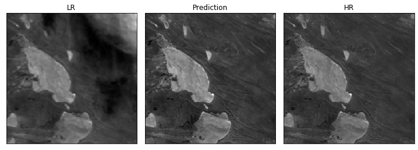
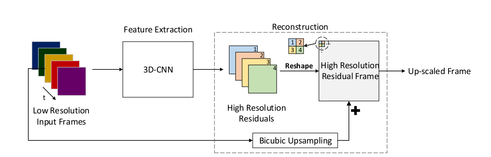
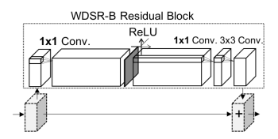
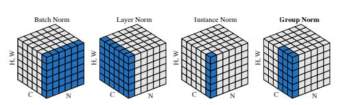

# EnhanceMe! : PROBA-V Super Resolution Challenge
<p align="center">  </p>

A solution to the PROBA-V Super Resolution Competition. This solution treats the multiple low resolution images as frames of a 'video' and 3D Convolutional Network to produce a super resolution image from the low resolution ones.


## TODO List
- [x] Preprocessing Pipeline
- [x] Training Framework
- [x] Prediction Framework (for competition submission)
- [ ] Preliminary Report
- [ ] Low resource training backend
- [ ] Parse Config Framework
- [ ] Multi-GPU support
- [ ] Colored Images support

## Requirements
```python
torch=1.4
tensorflow=2.0.1
tensorflow-addons=0.5.2
scikit-image=0.15
numpy
matplotlib
tqdm
```

## Usage
I shall implement an editable config file mechanism in the future as I find it really annoying when I make a typo in command line and not being able to correct it fast. But maybe one could use shell scripts for this.
### Preprocessing
```sh
python3 utils/dataGenerator.py --dir probav_data \
                               --ckptdir dataset \
                               --band NIR

```
### Train

The training was done in a computer with the following specifications:
* RAM: **64GB**
* Swap Space: **72GB**
* GPU: **GTX1080ti**
If you don't have a computer with high RAM, consider lowering the batch size or lowering the number of residual blocks of the network. If you have better specs, try raising the number of low resolution images and increasing the residual blocks for better performance.

```sh
python3 train.py --data dataset/augmentedPatchesDir \
                 --band NIR \
                 --split 0.3 \
                 --batchSize 64 \
                 --epochs 100 \
                 --logDir modelInfo/logs \
                 --ckptDir modelInfo/ckpt \
                 --optim nadam \

```
### Test
```sh
python3 test.py --data dataset/augmentedPatchesDir \
                --band NIR \
                --modelckpt modelInfo/ckpt \
                --output output
```

## The Results
Here are what I tried. Most of them did not end well. I am still waiting for the result of my submissions. (The Post-Mortem evaluation server is down at the moment.)

| Net           | Data          | ResBlocks | Filters  | Loss | Normalization |Score |
| ------------- |:-------------:| -----:| -----:|-----:|-----:|-----:|
| Conv3D + WDSR    | Patches 32x32 70% Clarity 7 LR Images | 8 |32  |L1  | Weight  |-  |
| Conv3D + WDSR      | Patches 38x38  90% Clarity 7 LR Images |   8 | 32    |L1    | Weight  |-    |
| Conv3D + WDSR      | Patches 38x38  90% Clarity 7 LR Images |   10 | 32    |L1    | Weight  |-    |
| Conv3D + WDSR      | Augmented Patches 38x38 85% Clarity 7 LR Images |   10 | 32    |L1    | Weight  |-    |
| Conv3D + WDSR      | Augmented Patches 38x38 85% Clarity 9 LR Images |   10 | 32    |L1    | Weight  |-    |
| Conv3D + WDSR  | Augmented Patches 38x38 85% Clarity 9 LR Images |   10 | 32    |L1 and Sobel L1 Mix   | Weight  |-    |
| Conv3D + WDSR + InstanceNorm     | Augmented Patches 38x38 85% Clarity 9 LR Images |   10 | 32    |L1    | Weight  |-    |

## The Model
The model is based on the well known [WDSR](https://arxiv.org/abs/1808.08718) super resolution neural network architecture which performed very good in DIV2K super resolution dataset. This architecture takes in low resolution images and predicts its high resolution version by using 2D convolutional neural network.

PROBA-V dataset is peculiar since multiple low resolution images are available for predicting the high resolution image. We can view this as the temporal information being available to us. In other words, those low resolution images can be treated as frames of a video and in videos, time one dimension of information.

There is this paper where the researchers used [3D Convolutional Residual Networks(3DSRnet)](https://arxiv.org/abs/1812.09079) networks to generate super resolution video from low resolution ones. We will use that architecture along with [WDSR](https://arxiv.org/abs/1808.08718) blocks to build our network.

### Residual Conv3D and WDSR Combined
The proposed architecture in [3DSRnet](https://arxiv.org/abs/1812.09079) is as follows.

<p align="center">  </p>

Like any residual nets, this architecture has a main path and a residual path. We replace the bicubic upsampling block with Weight normalized Conv2D net of the mean of the low resolution images. We replace the 3D-CNN block with multiple [WDSR](https://arxiv.org/abs/1812.09079) Residual blocks.

<p align="center">  </p>

We also apply instance normalization on the images before entering the main and residual paths.

<p align="center">  </p>


## The Loss Function
The loss function is a way of expressing what you want the neural net to learn. In my past attempts on this problem, I noticed that the edges of my prediction are not as sharp as that of the high resolution images. So I created a loss function that allows me to penalize the network if my prediction's edges does not match that of the ground truth.

I propose the following loss function.

$ Loss(HR, SR) = pi * L1 + (1 - pi) * SobelEdge$

* [3DSRnet: Video Super-resolution using 3D Convolutional Neural Networks](https://arxiv.org/abs/1812.09079)
* [Wide Activation for Efficient and Accurate Image Super-Resolution](https://arxiv.org/abs/1808.08718)
* [Instance Normalization: The Missing Ingredient for Fast Stylization](https://arxiv.org/abs/1607.08022)
